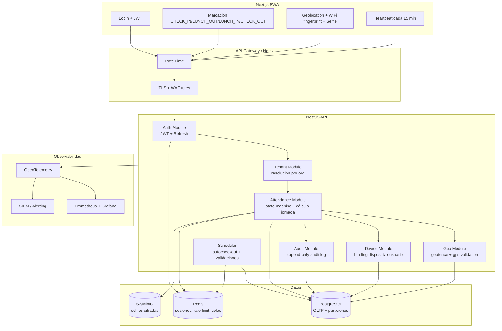

# Sistema de Control de Asistencia Geolocalizado (Multi-tenant)

## 1) Diagrama de arquitectura

## 2) Modelo de base de datos (PostgreSQL)

Archivo SQL: `docs/attendance/schema.sql`.

### Principios de diseño
- Multi-tenant estricto por `tenant_id` en TODAS las tablas de negocio.
- Integridad temporal y trazabilidad legal (append-only audit).
- Índices por `tenant_id + user_id + occurred_at` para consultas de jornada.
- Geofences por tenant para sedes múltiples.

### Entidades clave
- `tenants`, `offices`, `users`, `user_devices`
- `attendance_records` (eventos oficiales)
- `presence_heartbeats` (validación periódica)
- `attendance_daily_summary` (materialización diaria)
- `audit_log` (inmutable)

## 3) Endpoints API detallados (REST)

Base path: `/api/v1`

### Auth
- `POST /auth/register`
- `POST /auth/login`
- `POST /auth/refresh`
- `POST /auth/logout`

### Attendance
- `POST /attendance/events` registra `CHECK_IN | LUNCH_OUT | LUNCH_IN | CHECK_OUT`
- `GET /attendance/me/today`
- `GET /attendance/me/range?from=&to=`
- `GET /attendance/users/:userId/range` (HR, ADMIN, SUPER_ADMIN)
- `PATCH /attendance/events/:id` (**solo SUPER_ADMIN**, audit obligatorio)

### Geo & Device
- `POST /devices/bind`
- `POST /geo/validate` (pre-validación opcional en cliente/servidor)
- `POST /attendance/heartbeat` (cada 15 min)

### Administración
- `POST /tenants/:tenantId/policies`
- `POST /offices`
- `PATCH /offices/:id/geofence`
- `GET /audit/events?entityType=&entityId=&from=&to=`

## 4) Flujo completo de asistencia (incluyendo almuerzo)

### Secuencia válida
1. `CHECK_IN`
2. `LUNCH_OUT`
3. `LUNCH_IN`
4. `CHECK_OUT`

### Reglas de máquina de estados
- `CHECK_IN` solo si no existe evento abierto en el día laboral.
- `LUNCH_OUT` requiere `CHECK_IN` previo y no tener almuerzo abierto.
- `LUNCH_IN` requiere `LUNCH_OUT` previo sin retorno.
- `CHECK_OUT` requiere `CHECK_IN` y cierra jornada.
- Cualquier desviación -> `422 UNPROCESSABLE_ENTITY` con código funcional.

### Auto check-out por geofence
- Heartbeat cada 15 min.
- Si usuario está fuera de geofence por `N` heartbeats consecutivos (configurable, p. ej. 2):
  - Se emite `CHECK_OUT` automático con `source = AUTO_GEOFENCE`.
  - Se notifica usuario + supervisor.

## 5) Sistema de auditoría

### Requisitos de inmutabilidad
- Tabla `audit_log` sin `UPDATE` ni `DELETE` a nivel de rol aplicación.
- Trigger de protección para rechazar cambios.
- Cada edición por SUPER_ADMIN incluye:
  - `old_value` JSONB
  - `new_value` JSONB
  - `actor_user_id`
  - `reason`
  - `correlation_id`

### Eventos auditados
- Edición de marcaciones.
- Cambios de políticas de almuerzo, geofence y horarios.
- Vinculación/desvinculación de dispositivos.

## 6) Código base

Se incluye un esqueleto NestJS en `attendance-backend/src` con:
- JWT + refresh token strategy.
- State machine de eventos de asistencia.
- Cálculo de jornada incluyendo almuerzo.
- Auditoría obligatoria al editar eventos.
- DTOs y validaciones.

## 7) Estrategia anti-fraude

### Capas de defensa
1. **Posesión**: dispositivo firmado (`device_fingerprint`, llave pública opcional).
2. **Ubicación**: GPS principal + verificación secundaria por WiFi BSSID/SSID.
3. **Presencia humana**: selfie por evento + liveness challenge opcional.
4. **Persistencia de presencia**: heartbeat cada 15 minutos.
5. **Anomalías**: reglas de riesgo (saltos imposibles, GPS spoofing, rotación de dispositivos).

### Señales de riesgo sugeridas
- Distancia imposible entre eventos en corto tiempo.
- Desfase GPS vs WiFi geográfico.
- Múltiples usuarios en mismo dispositivo en ventana corta.
- Tasa de fallos selfie/liveness por encima de umbral.

## 8) Estrategia de despliegue (Docker)

Archivo: `infra/docker/docker-compose.attendance.yml`

Servicios:
- `attendance-api` (NestJS, 2+ réplicas en producción con orchestrator)
- `attendance-db` (PostgreSQL con backups + WAL archiving)
- `attendance-redis`
- `minio` (o S3 administrado)
- `nginx`

## Cumplimiento legal laboral (recomendaciones)

- Mantener trazabilidad de modificaciones y motivo por política interna.
- Retención configurable de evidencia (selfies, geologs) por jurisdicción.
- Consentimiento explícito del tratamiento biométrico y geolocalización.
- Derecho de acceso del trabajador a su historial de marcaciones.
- Políticas de minimización: almacenar hash facial y evidencia cifrada, evitar exposición en texto plano.

## Fórmula de cálculo de horas

`horas_trabajadas = (CHECK_OUT - CHECK_IN) - (LUNCH_IN - LUNCH_OUT)`

Se calcula en backend y se guarda snapshot diario en `attendance_daily_summary`.
